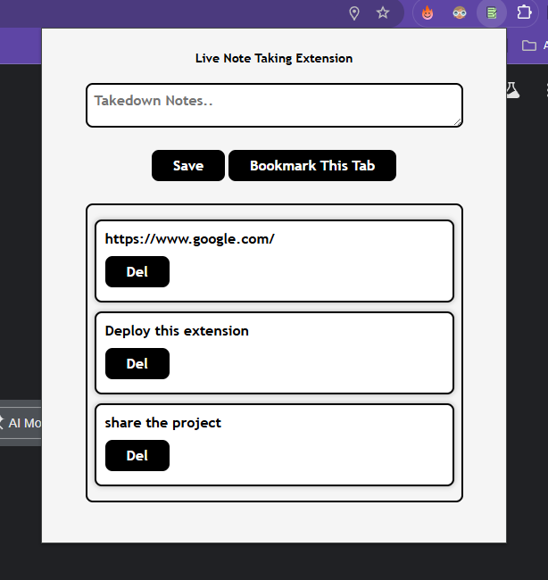

# 🖊️ Live Note-Taking Extension

A lightweight and privacy-focused browser extension for taking notes in real-time — right from a popup. Built as part of the [Scrimba Full Stack Developer Career Path](https://scrimba.com/).

---
## Screenshot

---

## 🚀 Features

- ✅ **Live Note-Taking** — type and save instantly in a clean popup UI
- 💾 **Persistent Storage** — uses `localStorage` to keep your notes safe, even after closing the browser
- 🧩 **Minimal UI** — simple, focused design for distraction-free writing
- ⚡ **Fast & Private** — 100% local, no internet or sign-in required
- 📋 **Copy to Clipboard** — quickly transfer your notes wherever you need

---

## 🔧 Built With

- HTML  
- CSS  
- JavaScript  
- Chrome Extension APIs  
- `localStorage`

---

## 📦 Installation (Manual)

To install this extension manually in Chrome:

1. **Clone or download** this repository
2. Go to `chrome://extensions/` in your Chrome browser
3. Enable **Developer mode** (toggle at top-right)
4. Click **"Load unpacked"**
5. Select the folder where this project is located
6. Pin the extension and start taking notes! 🖊️

---

